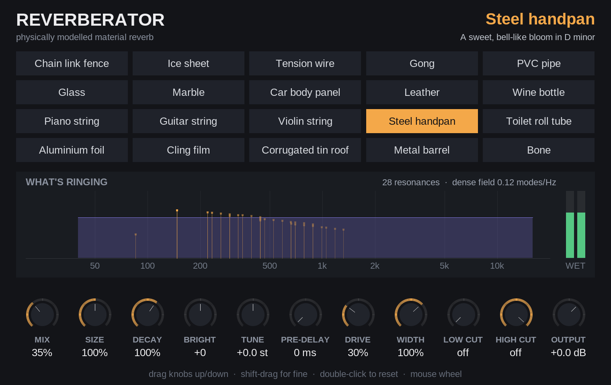

# Reverberator

A reverb that sends your sound through **odd materials** instead of a room —
the way a plate reverb sends it through a sheet of steel, or a spring reverb
through a coiled spring. Pick a material, and the plugin plays your audio
*through* a physical model of it.

It is a single-file **JSFX** plugin for REAPER: `Reverberator.jsfx`. No
compiling, no installer.

## The materials

| # | Material | What you hear | Where the sound comes from |
|---|---|---|---|
| 1 | Chain link fence | Metallic twang, laser-ish "pew", jangling | Two stiff 4 mm line wires (highs outrun lows) plus 24 mesh-link resonances set off by rattling |
| 2 | Ice sheet | Descending "pew pew" echoes | Bending waves in 5 cm lake ice travel faster the higher they are, so every echo off the shore arrives as a falling chirp |
| 3 | Tension wire | Long droning sci-fi "blaster" chirps | 25 m and 31 m steel guy wires; tension carries the lows, stiffness races the highs ahead (Ben Burtt's blaster was a hammered guy wire) |
| 4 | Gong | A huge, dark, shimmering wash | 80 cm bronze tam-tam: its circular-plate modes plus a dense field above; Drive adds the delayed shimmer bloom |
| 5 | PVC pipe | Hollow, tubey flutter | The air column in 1.5 m of 2" pipe, open both ends, with the same air-loss physics as Trombolese |
| 6 | Glass | Bright, glassy, long ring | A free 800 × 600 × 5 mm pane: stiff, light, very low loss |
| 7 | Marble | Short stony "clink", pitched | A 1 m × 60 cm × 2 cm slab: thick and stiff, so few, high, sparse modes |
| 8 | Car body panel | Clanky metallic "bonk" | A 0.8 mm steel door skin; its curve stiffens the low modes so they bunch up around 340 Hz |
| 9 | Leather | Dead, thumpy drum-skin thud | A stretched hide like a frame drum; leather's internal friction kills it fast, and the pitch sags as it decays |
| 10 | Wine bottle | Hooty boom at ~110 Hz plus a glass clink | The air in a 750 ml bottle is a Helmholtz resonator; the glass wall rings on top |
| 11 | Piano string | Shimmering sympathetic halo | 24 piano strings (C2–B3) with the sustain pedal down, ringing along with whatever you play, through a spruce soundboard |
| 12 | Guitar string | Six open strings humming along | Steel strings in standard tuning radiating through a guitar body (air mode ~98 Hz) |
| 13 | Violin string | Nasal, woody sympathetic ring | G D A E strings heard through a violin body (A0 ~275 Hz, "bridge hill" ~2.5 kHz) |
| 14 | Steel handpan | Sweet, tuned, bell-like bloom in D minor | Nine tone fields (D Kurd), each tuned fundamental : octave : fifth, plus the shell's "Gu" port resonance |
| 15 | Toilet roll tube | Honky, boxy, talking-through-a-tube | 10 cm of cardboard tube; porous walls soak up the ring |
| 16 | Aluminium foil | Sizzly, crinkly, papery splash | A 16-micron sheet: vast numbers of overlapping modes, plus crinkle crackles when driven |
| 17 | Cling film | Soft, rubbery, kazoo-like buzz | Film so light the air it drags outweighs it 14×; loud input makes it slap and buzz |
| 18 | Corrugated tin roof | Rumbling, rattly, tinny | Ribbed 0.5 mm steel ~1800× stiffer along the ribs than across, with loose fixings that rattle |
| 19 | Metal barrel | Boomy "inside an oil drum" resonance with steel ring | The air cavity of a 205 litre drum, its two lids, and the steel shell |
| 20 | Bone | Dry, woody knock with a hollow, hooty core | A dried human shin bone: its hollow shaft bending and twisting (tuned against resonances measured on real tibiae), the air sealed in its marrow cavity, and at high Drive the clack of "rhythm bones" |

## Installing in REAPER

1. Download `Reverberator.jsfx` from this repository.
2. In REAPER choose **Options → Show REAPER resource path in explorer/finder**.
3. Open the **Effects** folder there and put `Reverberator.jsfx` in it (a
   subfolder is fine).
4. In the FX browser, press **F5** to refresh (or restart REAPER), then search
   for **Reverberator**. It appears as *JS: Reverberator - Material Reverb*.

Tip: like any reverb, it works best on its own track fed by sends, with
**Mix** at 100%.

## The interface



- **Pick a material** by clicking its tile.
- **Knobs**: drag up or down. Hold **Shift** while dragging for fine
  adjustment, **double-click** to return a knob to its default, or use the
  mouse wheel over it.
- **What's ringing** shows the material's resonances on a frequency scale
  (low on the left, high on the right). Each orange line is one resonance:
  the taller it is, the longer it rings, and it glows while it is sounding.
  Teal lines are strings and air columns with their overtones; teal bands are
  the ice's dispersive paths; the purple band is the dense wash of
  resonances too many to draw. The green meters show the reverb's level.

All controls can still be automated: in REAPER, click **Param** in the FX
window, or add envelopes as usual. If you embed the plugin in the track or
mixer panel, it shows a compact view: the material name and level meters.

## Controls

| Control | What it does |
|---|---|
| **Material** | Which object the sound goes through. |
| **Mix** | Dry/wet balance. Both are at full level at 50%. |
| **Size** | Scales the object. Bigger is lower in pitch and rings longer, as a real bigger object would. |
| **Decay** | Longer or shorter ring, without changing the object. |
| **Brightness** | Lets the high frequencies ring longer (+) or die faster (−). |
| **Tuning** | Transposes the object in semitones — useful for the piano, guitar, violin, handpan and bottle, which have real pitches. |
| **Pre-delay** | A gap before the reverb starts. |
| **Drive** | How hard the transducer hits the material. Above about 30% the level-dependent behaviour appears: the fence and tin roof rattle, foil crackles, cling film buzzes, the gong and barrel shimmer, membranes bend in pitch. |
| **Width** | Stereo width of the reverb. |
| **Low cut / High cut** | Filters on the reverb only. |
| **Output** | Overall level. |

Changing **Material**, **Size** or **Tuning** rebuilds the object, so the tail
restarts; the other controls change smoothly.

All 20 materials are level-matched (to within 0.1 dB on a test mix), so
switching between them doesn't jump in volume.

## How it works, briefly

Each material is written down as real physical numbers — stiffness (Young's
modulus), density, thickness, tension, how much energy it loses per cycle —
and the plugin *derives* the sound from them, using three engines:

- **Waveguides** for strings, wires and air columns: a delay loop the length
  of one round trip, with the losses and the *dispersion* (high frequencies
  travelling faster in stiff materials, which is what makes the "pew") built
  into the loop.
- **Modes** for the strong, individually audible resonances of plates,
  membranes, shells and cavities, computed from the textbook formulas for
  each shape.
- **A dispersive feedback delay network** for the dense wash above them. Its
  size is set by the material's *modal density* — how many resonances it has
  per hertz — which for a plate depends only on its area, thickness and
  material.

On top of those sit the level-dependent effects: contact rattle, crinkle
crackle, the tam-tam's shimmer, and tension-modulation pitch glide.

Further reading:

- [`docs/MATERIALS.md`](docs/MATERIALS.md) — how the physics of each material
  was worked out, with the numbers.
- [`docs/PHYSICS.md`](docs/PHYSICS.md) — the formulas, reference tables and
  known simplifications.
- [`docs/adr/`](docs/adr/) — the design decisions and why they were made.
- [`docs/SESSION-LOG.md`](docs/SESSION-LOG.md) — how the plugin was built,
  including what went wrong.

## Relation to Trombolese

The air-column model (PVC pipe, toilet roll tube) reuses Trombolese's physics
directly: its Kirchhoff boundary-layer loss, which both damps the air and
slows it slightly, and its 0.6133 × radius end correction. Two of
Trombolese's lessons shaped the design: dispersion has to be **distributed
through the loop, not lumped** at one end, and the pitch has to be tuned
against the loop's **exact phase**, not an idealised length.

## For developers

`tools/` holds a headless test rig built on
[ysfx](https://github.com/JoepVanlier/ysfx), which runs JSFX with the same EEL2
engine as REAPER:

```bash
tools/build_host.sh                    # builds tools/build/render and inspect (~30 s)
python3 tools/check.py                 # loudness table + stability sweep (~10 min)
python3 tools/check.py --trims         # suggest loudness trims after a physics change
python3 tools/render_demos.py demos    # WAV demos of every material
python3 tools/spectrograms.py out.png  # impulse-response spectrogram grid
```

The Python tools need `numpy`, `scipy` and `matplotlib`. See `CLAUDE.md` for
the traps.

## Licence

MIT — see `LICENSE`.
