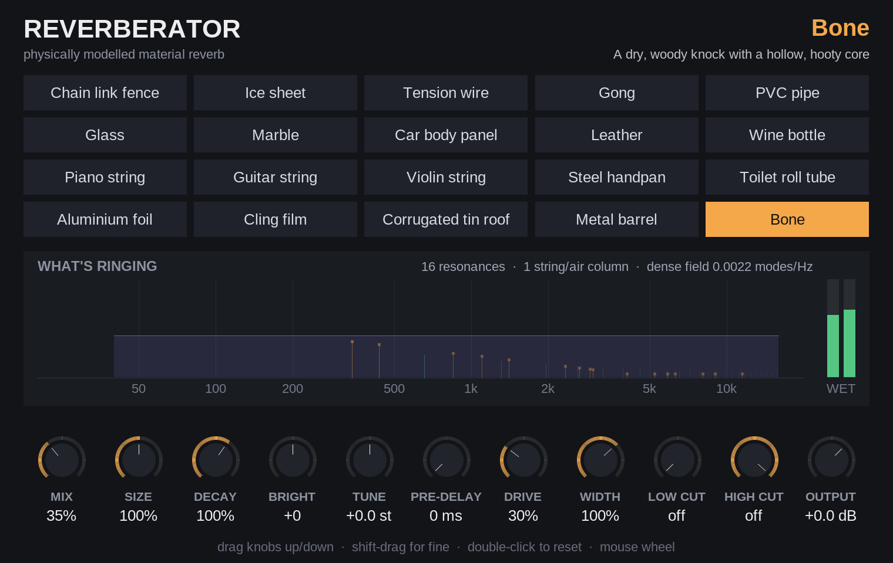

# How the physics of each material was worked out

`docs/PHYSICS.md` is the reference: formulas, tables, simplifications. This
document is the reasoning behind it: for each of the 20 materials, what was
asked, which physical system was chosen to answer it, the numbers that came
out, and what changed once the result was measured.

Every number below was computed from the constants in `Reverberator.jsfx`
(and re-checked with a script mirroring its formulas) or measured with the
tools in `tools/`. Material constants — Young's modulus E, density ρ,
Poisson's ratio ν, loss factor η — are typical handbook values for each
material, not measurements of particular objects; §1.3 lists them.

---

## 1. The method

### 1.1 The question asked of every material

A plate reverb works because a steel sheet has thousands of resonances packed
closely enough to smear into a wash, and because they decay slowly. The
question for each material was therefore the same:

1. **What actually vibrates?** Often more than one thing — a wine bottle is
   mostly the air inside it, then the glass; a guitar is strings *heard
   through* a wooden box.
2. **Which textbook system is that?** A stiff string, an air column, a plate,
   a membrane, a shell, a cavity, a Helmholtz resonator, a beam.
3. **What are realistic dimensions and material constants?** Chosen to be an
   ordinary example of the object: a 750 ml bottle, a 205 litre drum, window
   glass, 2" plumbing pipe.
4. **What does the model predict?** The resonance frequencies, how densely
   they are packed (modal density), how fast each decays (from η), and whether
   waves disperse (high frequencies travelling faster).
5. **Which engine represents that best?** See §1.2.
6. **Does it do that when rendered?** Checked by reading the plugin's own
   derived values back with `tools/build/inspect`, looking at impulse-response
   spectrograms, and measuring T60 and loudness with `tools/check.py`.

### 1.2 Mapping physics to engines

| What the physics looks like | Engine |
|---|---|
| A harmonic or near-harmonic series from a 1-D medium (string, wire, air column), or a pulse that travels and returns | **Waveguide**: a delay loop one round trip long |
| A handful of strong, individually audible resonances | **Modes**: one two-pole resonator each |
| Resonances too many and too close to list (a plate's thousands) | **FDN**: 8 mixed delay lines whose total delay equals the modal density |

Most materials use two or three engines, because most objects are more than
one system. The weights between engines are set by ear-free reasoning about
which system dominates what you hear (the bottle is "hoo" before it is
"clink"), and are true power proportions because every engine is normalised
to unit impulse-response energy (ADR 0007).

### 1.3 Material constants

| Material | E (GPa) | ρ (kg/m³) | ν | η | Where used |
|---|---|---|---|---|---|
| Steel | 200–207 | 7850 | 0.29–0.3 | 0.0004–0.004 | wires, car panel, roof, barrel, handpan, strings |
| Bronze | 110 | 8600 | 0.34 | 0.0004 | gong |
| Soda-lime glass | 70 | 2500 | 0.22 | 0.0008 | glass pane, bottle wall |
| Marble | 55 | 2700 | 0.26 | 0.003 | marble slab |
| Ice | 9 | 917 | 0.33 | 0.001 (paths), 0.004 (field) | ice sheet |
| Aluminium | 69 | 2700 | 0.33 | (see foil) | foil |
| PVC | 3 | 1400 | 0.4 | 0.03 | pipe wall |
| Paperboard | 3 | 700 | 0.3 | 0.06 | toilet roll tube wall |
| Spruce (along the grain) | 11 | 440 | 0.3 | 0.012 | piano soundboard |
| Leather | — (membrane: tension 1.5 kN/m, 1.08 kg/m²) | | | 0.06 | leather |
| Polyethylene film | — (membrane: tension 15 N/m, 0.011 kg/m²) | | | 0.12 | cling film |
| Cortical bone (dry) | 18 | 1900 | 0.3 | 0.02 | bone |

η, the loss factor, is the least certain column: it depends on mounting,
coatings and temperature as much as on the material. It is also the most
audible, since T60 = 2.2 / (f η). Where η was changed after listening to the
measurements (ice, car panel) it is noted below.

### 1.4 The two rules that apply everywhere

- **Decay from η.** A mode loses energy at σ = π f η, so T60 = 6.91 / (π f η)
  = 2.2 / (f η): high modes die faster, in proportion to frequency. A second
  term, `tmax`, caps the longest decay for losses η does not describe
  (supports, radiation into air, the floor it sits on). Brightness tilts the
  high-frequency end; Decay scales both.
- **Size scales everything consistently.** Making an object s times bigger in
  every dimension divides every frequency by s and multiplies its modal
  density by s; with η unchanged, T60 grows by s too. So Size multiplies all
  times, including decay, while Tuning transposes without changing decay.

---

## 2. Strings and wires

### 2.1 Tension wire

**The question.** What does a long wire under tension do to sound? The best
known answer is the Star Wars blaster: Ben Burtt hit a radio-tower guy wire
with a hammer, and a laser-like "pew" came out. Alan Lamb's long-wire
recordings show the other side: very long, droning sustain.

**The physics.** A real wire is a *stiff string*. Tension alone makes a
non-dispersive wave (speed √(T/μ)); bending stiffness adds a term that grows
with frequency, so the partials run sharp:

    f_n = n f0 √(1 + B n²),   B = π³ E d⁴ / (64 T L²)

Above the partial where B n² ≈ 1, stiffness dominates and high frequencies
travel faster and faster: a pulse arrives highs-first, sweeping down. That is
the pew.

**The numbers.** 2.5 mm steel, 2 kN tension, spans of 25 m and 31 m (one per
stereo side, so the echoes interleave):

| | 25 m | 31 m |
|---|---|---|
| linear density μ | 0.0385 kg/m | 0.0385 kg/m |
| wave speed √(T/μ) | 228 m/s | 228 m/s |
| f0 | 4.56 Hz | 3.67 Hz |
| B | 3.0 × 10⁻⁶ | 2.0 × 10⁻⁶ |
| stiffness takes over near | partial 575, ≈ 2.6 kHz | partial 713, ≈ 2.6 kHz |

Steel wire loses very little (η = 0.0004): T60 is 14.8 s at the fundamental,
9.7 s at 200 Hz and 1.3 s at 4 kHz.

**Implementation.** One waveguide per wire, with 96 allpass stages (stretched
by 2 at 48 kHz) for the dispersion, tuned so the loop's group delay matches
the stiff string at the fundamental and near 4 kHz. The physical spread of
arrival times between those two frequencies is 120 ms; the stages can supply
75 ms of it (62 %), see §7.1. A small FDN stands for the anchor posts.

**What was measured.** The impulse-response spectrogram shows the textbook
result: a train of downward-sweeping chirps every ~0.2 s, each more smeared
than the last. This was the first material that visibly worked.

### 2.2 Chain link fence

**The question.** A fence is two things at once: tensioned line wires along
the top and bottom, and a woven mesh of short wire links that jangle against
each other.

**The line wires.** 4 mm steel, 1.5 kN, spans of 3.0 m and 3.4 m between
posts. Thick and short, so they are much stiffer than the guy wire:
f0 = 20.6 / 18.1 Hz, B = 1.8 × 10⁻³ / 1.4 × 10⁻³, and stiffness takes over at
only ~680 Hz. The pew therefore sits in the midrange, where it is very
audible. Here the dispersion budget is enough: the loops supply 37.5 of the
39.9 ms the physics asks for (94 %).

**The mesh.** Between knuckles a link is a short beam of 2.5 mm wire, held at
both ends: clamped–clamped beam modes, 1 : 2.757 : 5.404, with

    f1 = (4.730)² / (2π L²) · √(E d² / 16ρ)

Eight link lengths from 55 to 85 mm give fundamentals from 1.55 kHz to
3.71 kHz — 24 bright, jangly modes, short-lived (η = 0.012, `tmax` 0.5 s)
because the joints are loose.

**The rattle.** The links are mostly set ringing by *hitting each other*, not
by the sound directly. That is modelled as a dead-zone on the wire and mesh
vibration: once it exceeds a gap, the excess becomes chatter, which drives the
link modes. The rattle's sensitivity was calibrated (ADR 0008) so that at
the default Drive (30 %) it sits 17 dB under the clean sound, and at 100 % it
is 3 dB above it.

### 2.3 Piano string

**The question.** Pressing the sustain pedal and shouting into a piano gives a
famous shimmering halo: every string whose partials match what you sang rings
back. That — sympathetic resonance — is "reverb through piano strings".

**The physics.** 24 strings, C2 to B3, stiff strings as in §2.1. Real piano
scales shorten the strings less than a factor of two per octave, so the
length rule used is L = 0.62 m × 2^(0.85·(60 − note)/12), capped at 1.9 m.
Bass strings are wound (core 1.2 mm), treble plain (1.0 mm), all at 800 N:

| note | L | core | B | partial 10 sharp by |
|---|---|---|---|---|
| C2 (65 Hz) | 1.90 m | 1.2 mm | 7.0 × 10⁻⁵ | 6 cents |
| B2 (123 Hz) | 1.17 m | 1.2 mm | 1.8 × 10⁻⁴ | 15 cents |
| C3 (131 Hz) | 1.12 m | 1.0 mm | 9.7 × 10⁻⁵ | 8 cents |
| B3 (247 Hz) | 0.65 m | 1.0 mm | 2.9 × 10⁻⁴ | 24 cents |

B from 10⁻⁴ to 3 × 10⁻⁴ is the range measured on real pianos in this
register, which was the check that the scale rule was sensible. The step at
the wound/plain break is real too.

Each string's fundamental is set to the *tuned* note, so f0 = f_note / √(1+B).
With η = 0.00012 and `tmax` 18 s, the fundamentals ring 15–17 s and 2 kHz
partials 6 s. A spruce soundboard (9 mm, 1.8 m²: modal density 0.066 per Hz,
so a 66 ms FDN, T60 0.5 s at 200 Hz) is the diffuse part the strings radiate
through.

**Compromise.** Four allpass stages per string give the treble strings their
full inharmonicity but the lowest strings only ~43 % of theirs; 24 strings
with more stages would cost too much CPU. The piano is already the most
expensive material (≈16 % of a core).

### 2.4 Guitar string

**The question.** The same sympathetic effect, but with six open strings and a
hollow body that colours everything.

**The strings.** Standard tuning, 648 mm scale, 110 N each, core diameters
0.25–0.46 mm: B from 8 × 10⁻⁶ (top E) to 9 × 10⁻⁵ (low E). With η = 0.0003
they ring 4.7–5.6 s.

**The body.** The first resonances of an acoustic guitar are well documented
and quite consistent: the air (Helmholtz) mode near 98 Hz, the top plate's
first mode near 204 Hz, a back mode near 226 Hz, then modes up through ~2 kHz.
Twelve are used, with Q from 20 to 45 (the air mode's T60 is 0.3 s). These
values are typical published figures rather than derived from wood
properties, because a guitar top's bracing matters more than its material.

**Routing.** The input drives the strings and, weakly, the body; the strings
drive the body. The output is half strings, half body — the body is what
makes it sound like a guitar rather than six sine-ish tones.

### 2.5 Violin string

As for the guitar, but the body dominates more: a violin is heard almost
entirely through its body. G3 D4 A4 E5 on 328 mm, with B values of typical
published magnitude (1.8 × 10⁻⁴ for the wound G down to 5.5 × 10⁻⁵ for the
steel E) and η = 0.0015, giving T60 from 2.1 s (G) to 1.3 s (E).

The body modes carry the identity: A0 (the air mode, ~275 Hz), the corpus
modes around 405–550 Hz, and the "bridge hill" — a cluster of resonances
around 2–3 kHz that gives violins their brilliance, represented by four
modes from 2.1 to 3.3 kHz. The output is 65 % body.

---

## 3. Air columns

### 3.1 PVC pipe

**The question.** Sending sound down a pipe gives a hollow, flutter-echo,
"tubey" colour. What decides its pitch and how long it rings?

**The physics — taken from Trombolese.** This is exactly the problem
Trombolese's stage 1 solved for its bore, so its acoustics were reused:

- **Boundary-layer loss.** Viscous and thermal losses at the wall give an
  attenuation α(f) = √(πf) · 0.00573 / (a c) nepers per metre (the 0.00573
  is √ν + (γ−1)√(ν/Pr) for air at 20 °C).
- **The same loss slows the wave**: Re k = ω/c + α, so the resonances sit
  slightly flat. In Trombolese, a waveguide that ignored it played ~65 cents
  sharp at its bore's fundamental; this pipe's fundamental comes out 10 cents
  flat of c/2L_eff.
- **End correction** of 0.6133 a at each open end.
- **Radiation**: each open end reflects |R| ≈ exp(−(ka)²/2).

**The numbers.** 2" pipe (52 mm bore, a = 26 mm), 1.5 m and 1.62 m long, open
both ends:

| | 1.5 m pipe |
|---|---|
| L_eff | 1.532 m |
| f1 (lossless) | 112.0 Hz |
| f1 (with boundary layer) | 111.4 Hz (−10 cents) |
| loss per round trip at f1 | 3.9 % → T60 1.56 s |
| loss per round trip at 4 kHz | 97.9 % (ka = 1.9) → T60 16 ms |

So the pipe rings in the bass and lets its treble straight out of the ends —
which is why the broadband measured T60 is only 0.08 s while the low
harmonics hum on. The PVC wall adds dull ring modes (cylindrical shell
bending: 766 Hz, 2.17 kHz, 4.15 kHz…) that die in ~80 ms (η = 0.03).

**Implementation detail that matters.** The loop is tuned so its *total
phase* at the fundamental is 2π, including the phase of the loss filter —
which here is a strong lowpass. Tuned by length instead, the pipe would be
audibly flat. This is Trombolese's other lesson (ADR 0006).

### 3.2 Toilet roll tube

The same model, small and lossy: 100 mm (and 104 mm for the other stereo
side) of 44 mm cardboard tube, open both ends. f1 = 1349 Hz, ka = 0.54 so
the ends already leak, and cardboard's rough, porous inner wall is modelled
as four times a smooth pipe's boundary-layer loss. Result: 29 % of the energy
lost per round trip, a T60 of 15 ms — a resonant honk, not a ring. The
paperboard wall's ring modes (793 Hz, 2.24 kHz, 4.30 kHz) are dead within
40 ms. It is the least reverb-like material, and that is the honest answer to
"what does a toilet roll tube do".

---

## 4. Plates

For all plates the bending stiffness is D = E h³ / 12(1 − ν²), the mode
frequencies of a simply supported rectangle are

    f_mn = (π/2) √(D / ρh) · ((m/Lx)² + (n/Ly)²)

and the modal density — the number that decides whether a plate sounds like a
reverb or a bell — is

    n = (S/2) √(ρh / D)   per hertz, at every frequency.

The FDN's total delay is set to n (ADR 0004), and the lowest 16–32 modes are
also added individually. Driving and pickup points are fixed off-centre
((0.37, 0.43) to (0.21, 0.64) and (0.74, 0.27)) so that each mode's strength
in each channel follows its real shape.

### 4.1 Glass

A free 800 × 600 × 5 mm pane. D = 766 N·m. The first mode is only 53 Hz
(windows really do rattle that low), the modal density is 0.031 per hertz (a
31 ms FDN — sparse, so glassy and ringing rather than smooth), and glass is
very low loss (η = 0.0008): T60 is 4.2 s at 200 Hz, 1.9 s at 1 kHz and 0.6 s
at 4 kHz. Measured broadband T60: 3.8 s. The input is high-passed at 120 Hz so
that bass doesn't simply rattle the pane.

### 4.2 Marble

A 1 m × 60 cm × 20 mm slab. Four times thicker than the glass, and bending
stiffness goes as thickness cubed, so D = 39 300 N·m — fifty times the glass —
and the first mode
rises to 160 Hz while the modal density drops to 0.011 per hertz (an 11 ms
FDN). Stone is lossier than glass (η = 0.003): 1.5 s at 200 Hz, 0.57 s at
1 kHz, 0.17 s at 4 kHz. So marble is sparse, pitched and short — the "clink"
of a lithophone — and the modes carry 65 % of the output.

### 4.3 Car body panel

**The question.** Why does a car door go "bonk" rather than "wobble"?

**The physics.** As a flat plate, 0.8 mm steel of 1.1 × 0.8 m would have its
first mode at 4.6 Hz — it would flap. It doesn't, because it is *curved*.
Curvature couples bending to in-plane stretching, which is far stiffer, and
everything below the panel's ring frequency (c_L / 2πR: 325 Hz for a 2.5 m
radius; 340 Hz is used) is pushed up towards it. The standard approximation
f′ = √(f² + f_ring²) was applied to every mode, and the 16 lowest all land
just above 340 Hz: a bunched cluster — the bonk. The FDN input is
high-passed at the ring frequency for the same reason.

Above the ring frequency the panel behaves as a flat plate, and a thin one:
modal density 0.355 per hertz, a 355 ms FDN — as dense as a real plate
reverb.

**What changed.** The first version used η = 0.006, for a panel with
anti-drumming treatment, giving T60 0.96 s at 200 Hz. It measured as a very
short clunk, too short to be useful as a reverb, so η was halved to 0.003
(bare, painted panel): 1.5 s at 200 Hz, measured broadband 1.1 s. A small
rattle (trim clips) was added; its sensitivity needed four times the default
to be audible at all, because the high-passed field is quiet at the rattle's
input.

### 4.4 Corrugated tin roof

**The question.** A tin roof is a plate with ribs. What do ribs do?

**The physics.** Corrugations make the sheet an *orthotropic* plate. Across the
ribs it bends like a flat 0.5 mm sheet: D_y = 2.37 N·m. Along them, the ribs
act like a deep beam; for sinusoidal corrugations of depth d the stiffness is
about D_x = E h d² / 8 = 4190 N·m — **1770 times** stiffer. The mode
frequencies become

    f_mn = (π/2) √( (D_x (m/L_x)⁴ + 2H (mn/L_xL_y)² + D_y (n/L_y)⁴) / ρh )

with H ≈ D_y. A bay between purlins (0.9 m × 0.8 m) has its first mode at
63 Hz, then a crowd of modes that climb only slowly in n (across the ribs) and
steeply in m (along them) — a low rumble.

The whole roof (5.8 m² of sheet) has an orthotropic modal density
(S/2) √(ρh) / (D_x D_y)^¼ = 0.58 per hertz. At that density and this much
loss (T60 1.3 s at 200 Hz) the modes overlap, so the FDN is capped at
0.3 × T60 = 393 ms (ADR 0004). Its line lengths are spread wider than the
other materials' (spread 1.6) to echo the two very different wave speeds.

**The rattle.** Tin roofs are screwed down loosely and rattle; it is driven
from the dense field and the modes, and calibrated to sit 15 dB down at the
default Drive.

### 4.5 Aluminium foil

**The question.** Foil is the thinnest plate there is. What does 16 microns
do?

**The physics.** D = 2.6 × 10⁻⁵ N·m — thirty million times less than the
glass. For a 30 × 45 cm sheet, the modal density is 2.7 modes per hertz:
tens of thousands of modes below 20 kHz. But foil is always crumpled, and the
crumples rub, so the damping is enormous and every mode overlaps its
neighbours. In that regime the individual modes stop mattering: the response
is a smooth, noisy sizzle, and a longer network would only produce audible
discrete echoes. The FDN is capped at 0.3 × T60 = 105 ms (with T60 set
directly: 0.35 s low, 0.12 s high).

The crumpled facets are represented statistically — twelve short-lived modes
from 1.5 kHz to 10 kHz — and handling the sheet is represented by
**crackle**: random crinkle impulses whose rate rises with the input level,
fed into the field. At the default Drive the crackle is about 6 dB under the
rest; at full Drive, level with it.

---

## 5. Circular plates and membranes

### 5.1 Gong

**Which gong.** A tuned, bossed gamelan gong has a clear pitch and would be a
modal instrument. The sound most people mean by "gong" — the orchestral crash
— is the flat **tam-tam**, which has no pitch and a slowly blooming shimmer.
The tam-tam was chosen (ADR 0014).

**The physics.** A free circular plate: f = λ² / (2π a²) · √(D / ρh), with λ²
for a free edge from Leissa's tables (5.253 for the (2,0) mode, 9.084 for
(0,1), 12.23, 20.52…). An 80 cm bronze tam-tam 3 mm thick gives modes at
17, 30, 40, 67, 71, 108, 116, 126, 151, 173, 196 and 200 Hz — the low ones
sub-audio, the rest a dark boom. Each mode with angular order m > 0 is a
degenerate pair, split by 0.3 % so it beats, as real gongs do.

The modal density is 0.076 per hertz (a 76 ms FDN), and bronze loses almost
nothing (η = 0.0004): T60 16 s at 200 Hz, 1.3 s at 4 kHz. The dense field,
not the low modes, is most of what you hear.

**The shimmer.** A tam-tam struck hard doesn't reach full brightness at once:
energy cascades from low modes to high over a second or two. That is a
geometric (large-amplitude) nonlinearity. It is modelled as the square of the
modal output feeding the dense field — squaring makes sum and difference
frequencies, pumping energy upward — and it is level-dependent through Drive.
The first calibration was far too strong (+5 dB over the clean sound at full
Drive); the curve was changed to rise with Drive² (ADR 0008).

### 5.2 Leather

**Which leather.** A slab of loose leather is just a dead thud. A stretched
hide — a frame drum, a tabla head, a leather chair seat — resonates, and it
is the more interesting answer, so it was chosen (ADR 0014).

**The physics.** An ideal circular membrane: f_mn = j_mn / (2π a) · √(T/σ),
with j_mn the zeros of the Bessel functions. A 40 cm hide, 1.2 mm thick
(σ = 1.08 kg/m²) at 1.5 kN/m, would have its fundamental at 71 Hz.

But a membrane moves air, and the air it drags along adds mass — about
2ρ_air/k per square metre for a mode of wavenumber k. For this hide that is
0.20 kg/m², enough to lower the fundamental to 65.5 Hz and stretch the mode
ratios slightly (1 : 1.64 : 2.23 : 2.40 instead of the ideal
1 : 1.59 : 2.14 : 2.30). The same air-loading ratio sets extra radiation
damping.

Leather's internal friction is huge (η = 0.06, 0.09 once radiation is
added): the fundamental's T60 is 0.25 s, higher modes far less. Its pitch
**sags** as it decays, because a large vibration stretches the skin and
raises its tension; that is modelled as mode frequencies rising with the
vibration envelope.

### 5.3 Cling film

**The question.** What happens with a membrane that weighs almost nothing?

**The physics.** 12-micron polyethylene weighs 0.011 kg/m². Stretched over a
30 cm bowl at 15 N/m, the ideal-membrane fundamental would be 94 Hz. But the
air it drags along weighs 0.150 kg/m² — **13.7 times** the film. So the air,
not the film, is the vibrating mass:

- the fundamental falls to **24.6 Hz**;
- the modes rearrange, because air loading falls with wavenumber: the first
  four come out at 1 : 1.97 : 3.01 : 3.33 — nearly harmonic, by accident of
  the air (the same effect that helps tune timpani);
- almost all the energy radiates away at once: effective η ≈ 0.40, T60
  0.14 s for the fundamental.

This was the most surprising result of the physics and is why cling film
sounds soft and "papery" rather than drum-like.

**The buzz.** Loud sound makes stretched film slap against its rim — which is
exactly how a kazoo works. That is the rattle, driven from the membrane's own
motion and sent only to the output (never back into the membrane, ADR 0008),
calibrated to sit 17 dB down at the default Drive. The film's pitch also
glides strongly with level.

---

## 6. Shells, cavities and combinations

### 6.1 Wine bottle

**What vibrates.** Blow across a bottle and you hear its air, not its glass.
So the bottle is first a Helmholtz resonator:

    f = (c / 2π) √( A / (V L_eff) )

750 ml of air (V = 7.5 × 10⁻⁴ m³) behind a neck of radius 9.5 mm and length
80 mm; with end corrections L_eff = 80 + 1.46 × 9.5 = 93.9 mm. That gives
**109.6 Hz** — and real wine bottles blow at about 110 Hz, which was the first
cross-check that the method was producing believable numbers. Q = 35 (radiation
and viscous loss in the neck) gives a 0.57 s ring.

Above it: the body's own air modes (longitudinal, c/2H: 858 Hz and 1716 Hz;
the first cross mode 1.8412 c / 2πa: 2718 Hz), then the **glass wall**. A
bottle's wall is a cylindrical shell, whose bending ("ring") modes are

    f_n = (h / (2π a² √12)) √(E / ρ(1 − ν²)) · n(n² − 1) / √(n² + 1)

For 4 mm glass at 37 mm radius: 1954 Hz, 5526 Hz, 10.6 kHz, 17.1 kHz. Each
is a degenerate pair (the ring can bend along any diameter), split by 0.4 %
so it beats, as a struck glass does. Glass is low loss: the 1954 Hz ring
lasts about a second.

The output is 85 % modes: hoot first, clink second.

### 6.2 Metal barrel

A 205 litre steel drum is three systems:

- **The air inside** is a closed cylinder (572 mm × 851 mm). Its modes combine
  longitudinal standing waves (c/2H: 201.6, 403, 605, 807 Hz) with cross modes
  set by the Bessel-derivative zeros α_mn (1.8412 c / 2πa = 352 Hz, then 583,
  732, 802 Hz): f = (c/2) √((p/H)² + (α_mn/πa)²). All combinations below
  900 Hz are included (about 20), with Q = 60. This is the "inside an oil
  drum" boom.
- **The two lids** are clamped circular plates. A plain 1.2 mm lid would
  resonate implausibly low, but drum lids are stiffened with pressed rings, so
  an effective thickness of 2.4 mm is used: 104, 217, 357, 407 Hz…, the two
  lids 2 % apart.
- **The shell** is 1.53 m² of 1.2 mm steel: modal density 0.41 per hertz, a
  411 ms FDN, T60 2.6 s at 200 Hz. The FDN is high-passed at 120 Hz so the
  low end belongs to the air.

Light shimmer (the shell is thin and rings hard) comes in with Drive.

### 6.3 Steel handpan

**The physics.** A handpan's notes are dimpled tone fields hammered into
nitrided steel. Each is tuned by the maker so its first three modes sit at
**fundamental, octave and compound fifth (1 : 2 : 3)** — which is why a
handpan sounds sweet rather than clangy. That tuning is an engineering fact
about the instrument, so it is used directly rather than derived from plate
theory, which could not predict a hand-hammered shape.

A D Kurd scale (D3 A3 B♭3 C4 D4 E4 F4 G4 A4) gives 27 modes. Their losses
follow η as for any steel: the D3 fundamental rings 3.7 s, its octave 2.0 s,
its fifth 1.2 s; the A4's ring 1.8 / 0.8 / 0.45 s — higher partials fade
first, as on the real instrument. The shell's bottom port makes a Helmholtz
resonance, the "Gu" (85 Hz, Q 12 — a typical value, not derived: it depends
on each maker's shell and port). The steel shell's dense field (0.44 m² of
1.2 mm steel: 0.118 per hertz, a 118 ms FDN) is a quarter of the output.

Sending sound through it makes the scale's notes bloom in sympathy — musically
the most "tuned" material; the Tuning control changes its key.

---

### 6.4 Bone

*Added after the first release, to fill the twentieth tile.*

**Which bone.** Bone has made music for at least 35 000 years — the Hohle
Fels vulture-bone flute is 21.8 cm long and about 8 mm across — and
"rhythm bones", pairs of rib or shin bones 12–18 cm long, are clacked
together as percussion. The model is a **dried human shin bone (tibia),
36 cm, intact**, chosen because it has published vibration measurements to
check against: in vitro, a tibia's first bending resonance is reported at
240–405 Hz, with a second peak at 400–500 Hz (ADR 0014).

**The material.** Cortical bone's stiffness along the bone is 15–24 GPa;
18 GPa and a density of 1900 kg/m³ are used — the same values as the user's
Wind-Instrument-Creator, which also models a bone bore's rough wall (factor
1.6 on the boundary-layer loss). Damping is the uncertain part: wet bovine
cortical bone under slow cyclic loading has a loss factor of 0.035–0.1, and
Wind-Instrument-Creator uses 0.012 at 1 kHz rising with frequency. Dried
bone at audio frequencies sits between: η = 0.02 is used, so the
fundamental rings ~0.3 s and 2 kHz ~0.05 s — a knock, not a ring.

**The shaft.** A tube of outer radius 11.5 mm and inner (marrow) radius
6.5 mm. As a plain free–free tube (Euler–Bernoulli),

    f₁ = (4.730)² / (2π L²) · √(E/ρ) · √((r_o² + r_i²)/4) = 559 Hz

— well above the measured 240–405 Hz. The difference is the heavy, knobbly
ends (epiphyses). A finite-element model of the tube (160 beam elements)
with a point mass at each end reproduced the plain-tube ratios exactly
(1 : 2.757 : 5.404) as a check, then with end masses of 0.35 × the shaft's
0.19 kg each — a 0.33 kg bone overall, plausible for a dried tibia — gave:

| | 1 | 2 | 3 | 4 | 5 | 6 |
|---|---|---|---|---|---|---|
| bending (Hz) | **340** | 1099 | 2340 | 4069 | 6290 | 9002 |
| ratio | 1 | 3.23 | 6.87 | 11.95 | 18.48 | 26.44 |

Heavy ends also stretch the overtones apart (3.23 rather than 2.76). A
tibia's cross-section is roughly triangular, not round, so it bends more
stiffly one way: each mode has a twin **1.28 × higher** (a second moment of
area 1.64 × larger), putting the first twin at **436 Hz** — inside the
measured 400–500 Hz second peak. The plugin stores the finite-element ratios
as a table, like Leissa's plate eigenvalues for the gong.

**Twisting and stretching.** The same finite-element approach for a rod
with heavy ends: lengthwise modes at 2648 and 5868 Hz (plain rod: 4275,
8550); twisting modes at 849 and 2919 Hz (plain: 2651, 5302) — twisting
drops furthest because the wide ends (modelled as solid 30 mm-radius
cylinders) have 1.8 × the shaft's rotational inertia.

**The marrow cavity.** In an intact, dried bone the marrow cavity is sealed
at both ends by spongy bone, so its air is a **closed–closed** column (the
air-column model was extended for this: no end correction, no radiation, no
inverting reflection): 26 cm of 6.5 mm radius gives c/2L = 660 Hz, pulled
17 cents flat by the boundary layer — Trombolese's effect again — to 654 Hz,
and the narrow, rough bore damps it in 0.11 s. Being sealed, it is heard
through the wall, at a fifth of the output.

**The clack.** Rhythm bones are two bones knocking together. At higher
Drive, the bone's vibration exceeding a gap produces contact chatter from
the modes to the output (never back into them, ADR 0008), calibrated like
the other rattles: −16 dB under the clean sound at the default Drive, −2 dB
at 60 %, +5 dB at full.

**The wall's dense field** is small: the shaft's wall as a 5 mm plate of
0.02 m² has a modal density of 0.002 per hertz, so the FDN is a few
milliseconds and carries 15 % of the output for diffusion only.

Sources consulted: cortical bone moduli and loss factor (Loughborough
University repository, *Analysis of anisotropic viscoelastoplastic
properties of cortical bone tissues*); tibia resonances (*Measuring
Structural Dynamic Properties of Human Tibia by Modal Testing*, IMAC XXVI,
2008, and related vibro-acoustic studies, as summarised in search results —
the papers themselves could not be fetched); rhythm bones (Wikipedia,
*Bones (instrument)*); the Hohle Fels flute (phys.org, 2009).

---

## 7. Waves that disperse

### 7.1 Ice sheet

**The question.** Skating on thin lake ice, or throwing a stone onto it,
produces the eerie descending "pew pew" that has become famous in online
recordings. Where does it come from?

**The physics.** Ice floating on a lake is a thin plate. Bending (flexural)
waves in a plate are dispersive — their group velocity rises with the square
root of frequency:

    c_g = 2 (D / ρh)^¼ √ω

For 5 cm of lake ice (E = 9 GPa, ρ = 917, ν = 0.33): D = 105 000 N·m,
(D/ρh)^¼ = 6.92, and c_g is 549 m/s at 250 Hz, 1097 m/s at 1 kHz and
2194 m/s at 4 kHz. So a click travelling 35 m to the shore and back arrives
as a chirp: 4 kHz after 32 ms, 250 Hz after 128 ms. Two paths (70 m and 96 m
round trips), one per stereo side, give interleaved pews.

**What went wrong first, and why.** The first version's spectrogram showed no
pews. Zooming in on the ice's waveguides alone showed two problems:

1. The chirps existed but were squashed into the bottom 1 kHz, because the
   dispersion solver had hit its coefficient limit (−0.9), which concentrates
   all of an allpass's delay at low frequencies.
2. They died within ~0.3 s, because η = 0.004 gave a T60 of only 0.13 s at
   4 kHz.

The underlying constraint is a budget (ADR 0005): a first-order allpass can
contribute π radians of phase *in total*, so the area under its group-delay
curve is fixed. The ice's physical chirp (96 ms spread over 0.25–4 kHz) would
need roughly a thousand stages. The fix spends a realistic budget better:
96 stages *stretched* by K = 4 (z⁻⁴ in place of z⁻¹), which concentrates
their whole budget in 0–6 kHz; the coefficient clamped at −0.72 so the delay
spreads across that band instead of piling into the bass; a 4th-order lowpass
at 4.5 kHz on the input to keep out the stretched filter's mirror images
above 6 kHz; and η lowered to 0.001 (T60 0.42 s at 4 kHz, 1.5 s at 250 Hz).

The result is 41 ms of each 96 ms chirp (43 %) in a single bounce — but the
echoes recirculate, and each trip adds its own dispersion, so later echoes
are progressively more drawn out, which is also what happens on real ice. The
spectrogram now shows the right shape: vertical at the top, curving down into
the bass, repeating.

---

## 8. What was not modelled, and why

- **Free edges** everywhere a plate is really free: simply-supported modes are
  used because free-edge rectangles have no closed form. Mode *spacing* and
  density — what you hear — are nearly the same.
- **Radial mode shapes** of circular plates: only the angular part sets the
  stereo weights.
- **Individual impacts** in rattles: the dead-zone captures the threshold and
  the broadband chatter, not the timing of each collision.
- **The bossed gong, slack leather, a real guitar's bracing**: each a
  deliberate choice of which version of the object to model (ADR 0014).
- **Full-length chirps**: limited by the dispersion budget (§7.1).
- **The bone as a perfect tube with point-mass ends**: real bones taper,
  curve and have triangular sections; the finite-element model uses a
  uniform tube (Euler–Bernoulli, so no shear or rotary inertia, which would
  pull its higher modes down somewhat) with two point masses. It is
  calibrated to the measured first two resonances, not to a scan of a bone.
